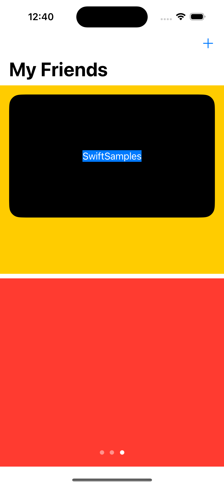

# Exploring GeometryReader and containerRelativeFrame

> [!TIP]
> Use the acronym **`EG&C`** to navigate within the source code.

`GeometryReader` and `containerRelativeFrame` are among the advanced ways to create a layout in SwiftUI. I think these are now the prerequisites for creating complex layouts in an Apple application.

This is rather a basic guide to implementing these two methods. For more information about these, here are the references I studied, all from Stewart Lynch:

-  [SwiftUI GeometryReader](https://www.youtube.com/watch?v=AXGrYI78hIo)
-  [Laying out views with ContainerRelativeFrame in SwiftUI](https://www.youtube.com/watch?v=DudvesMYAAY)

Now, it can be tempting to adjust the playback speed because he talks so slow, but for me, I adjusted it to 1.3x, and I think it's a sweet spot for speed and comprehension.

**BONUS**: This is the [video](https://www.youtube.com/watch?v=zzqKhitBQfM) that I used to create the swipable cards.

 

## How I Used Both Together

This is just an experiment on how I can customize layouts, and the end result is exactly what I had imagined in my mind. Mission accomplished.

1. **Create the VStack**: As the primary device of the app is a phone, I created a stack so that the views would be lined up vertically.

2. **Create the Upper View with Relative Frame**: The upper view is a `TabView` that presents the entries as cards. The use of `containerRelativeFrame` allows this view to be fixed. There is a `Rectangle()` below. You can add as many as you want there, but the upper view is fixed; the additional items are the ones adjusting.

3. **Create the Card**: The card is a `ZStack` that creates a rounded rectangle and places the name in front of it.

4. **Place the Buttons**: The placement of buttons uses relative dimensions. To achieve this, encapsulate the ZStack in a `GeometryReader`. Then use the dimensions of the `GeometryReader` to place the buttons within the card.

 

## My Experience In contentRelativeFrame

`contentRelativeFrame` is like the softcore version of `GeometryReader`; it gets layout information from the nearest container so that you can have a relative sizing to your view's size. But it has its own criteria on what constitutes a "container".

 

## My Experience In GeometryReader

Here are some of the things I noticed in using the `GeometryReader`, you can also find this in the videos I provided: 

`GeometryReader` acts like a container similar to VStack, HStack, and especially ZStack, but it places its child in the upper left.

It is **greedy** meaning that if you create one, it will occupy all of the available space that was given to it. This is the opposite of most views in SwiftUI, like Text and VStack, where they only occupy what is needed based on their contents.

The `GeometryReader` does not adjust its dimensions based on the child. If you have a child and reduced its height for example by 0.75, the 0.25 remaning would occupy blank space. Refer to the example below:

  

You can easily see the `GeometryReader` with the yellow background. The card as the child was reduced by 0.75, and the 0.25 occupies an empty space.

Ideally, the red background must adjust to fill the empty space due to the resizing, but that is not possible with `GeometryReader`.

> [!NOTE]
> What you can infer from this is that the `GeometryReader` that you create in layouts must act as the parent. To effectively create the layout for the children, it must be all encompassed inside the `GeometryReader`.